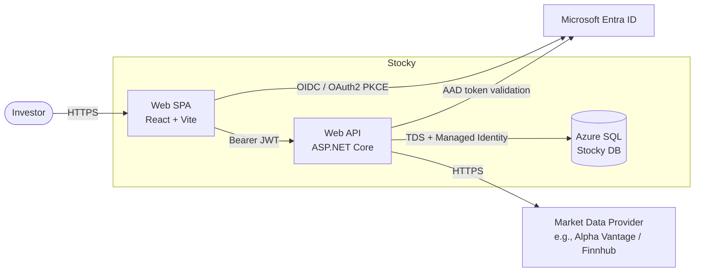
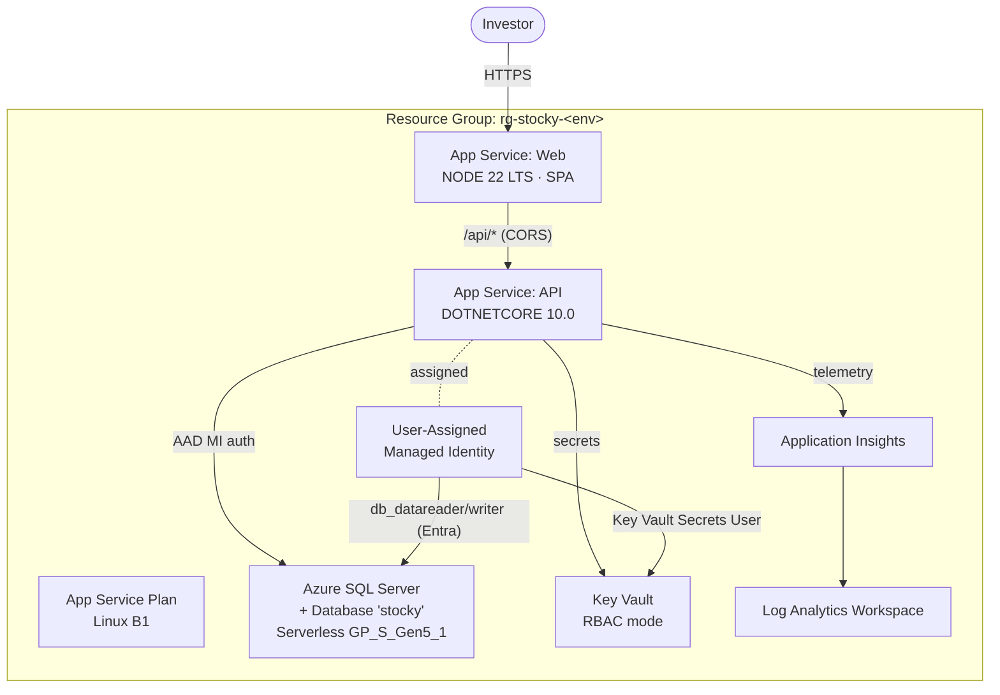
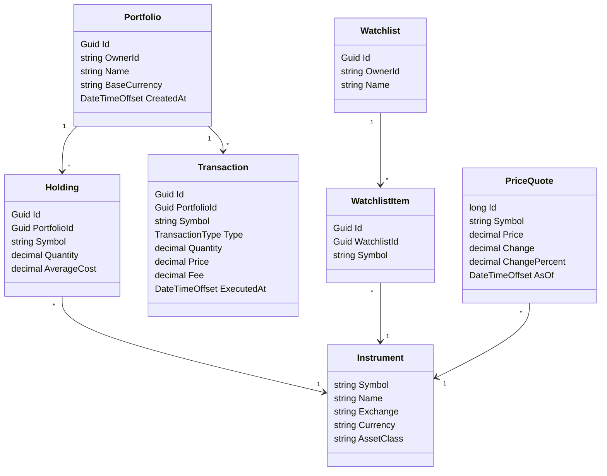
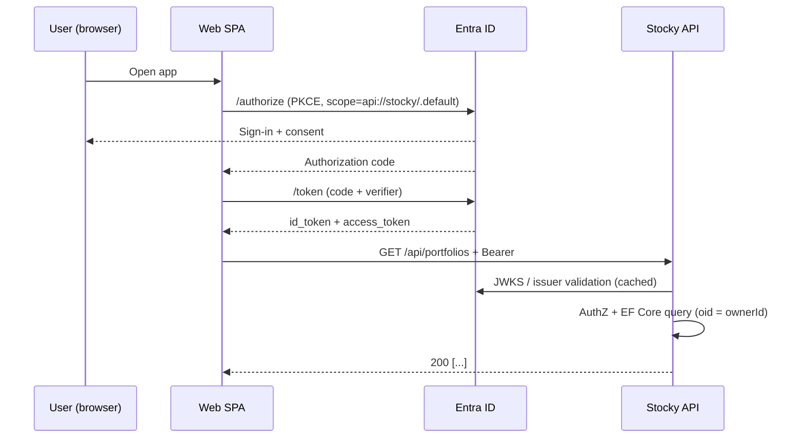

# Stocky — Architecture

> Stack: .NET 10 Web API · React 18 + Vite (TS) · Microsoft Entra ID · Azure SQL · Azure App Service · Bicep / azd.

## C4 — System Context



## C4 — Container View on Azure



## Domain Model



## Authentication Sequence



## Request Flow — Record a Buy Transaction

```mermaid
sequenceDiagram
    participant SPA
    participant API
    participant DB as Azure SQL
    SPA->>API: POST /api/portfolios/{id}/transactions {type:Buy, symbol, qty, price}
    API->>DB: SELECT Portfolio + Holdings WHERE OwnerId=oid
    API->>API: Upsert Instrument (if new symbol)
    API->>API: Update Holding (recompute avg cost)
    API->>DB: INSERT Transaction; UPDATE Holding
    API-->>SPA: 201 TransactionDto
```

## Non-functional decisions

- **Multi-tenancy / data ownership**: every row owned by `OwnerId` = Entra `oid` claim. All queries filter by `OwnerId` from `User.GetOwnerId()` (`Data/UserContextExtensions.cs`).
- **Auth**: SPA uses MSAL.js (PKCE). API uses `Microsoft.Identity.Web` (`AddMicrosoftIdentityWebApi`) — token validation against the configured tenant.
- **Database access**: API → SQL via **User-Assigned Managed Identity** (Active Directory Managed Identity in the connection string). No SQL passwords at runtime.
- **Secrets**: held in Key Vault; API references them via Key Vault references in App Settings or `DefaultAzureCredential`.
- **Observability**: Application Insights auto-instrumentation; logs/metrics forwarded to a shared Log Analytics workspace.
- **Cost**: SQL Serverless (auto-pause 60 min) and a single B1 plan keeps idle cost minimal; scale up tiers via `infra/main.bicep` parameters when ready.
- **CORS**: API only accepts the deployed Web hostname (set via `AllowedOrigins__0` in `main.bicep`) plus `http://localhost:5173` for local dev.

## Environment overview

| Component | Local | Azure |
| --- | --- | --- |
| Web | `vite dev` @ 5173 | App Service Linux (NODE 22), `pm2 serve --spa` |
| API | `dotnet run` @ 5xxx | App Service Linux (DOTNETCORE 10.0), `/health` probe |
| DB  | EF InMemory fallback | Azure SQL Serverless |
| Auth | Entra ID (dev tenant) | Entra ID (prod tenant) |
| Secrets | user-secrets | Key Vault + MI |
