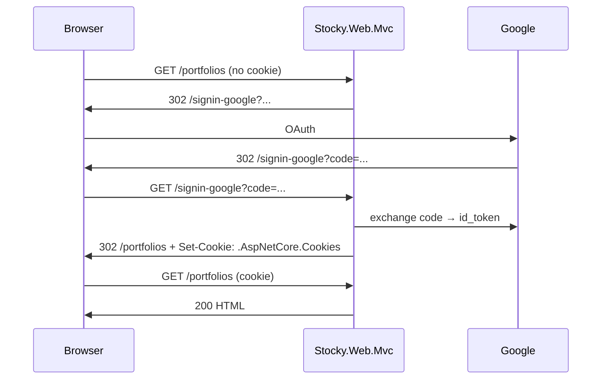

# Re-architecture: SPA → Server-Rendered (Non-SPA)

> Status: **Assessment complete · Foundation scaffolded · Page migration pending user sign-off**
> Author: GitHub Copilot (autonomous run, May 24 2026)
> Scope: Replace `src/Web` (React + Vite + Mantine SPA) with a server-rendered ASP.NET Core MVC + Razor Views app.

---

## 1. Executive summary

You asked to convert Stocky from an SPA architecture to a non-SPA architecture. After a full read of the codebase, this document captures:

1. **What's there today** — every moving part the change has to touch.
2. **Why this is non-trivial** — three features that genuinely don't survive the move cleanly.
3. **The target architecture** — recommended stack (ASP.NET Core MVC + Razor) and *why* over the alternatives.
4. **A page-by-page migration inventory** — 31 SPA routes mapped to MVC controllers/actions.
5. **Foundation work already done in this PR** — see `src/Web.Mvc/`.
6. **An ordered execution plan** — phases, risks, exit criteria, and rollback strategy.

**Recommendation:** approve the foundation, then migrate pages in the order listed in §7 (Dashboard → Holdings → Portfolios → … high-traffic and read-only first, write-heavy and chart-heavy last). Do **not** delete `src/Web/` until every route in §6 has a green parity test.

---

## 2. Current state — what we have to replace

| Layer | Tech | Files / count |
|---|---|---|
| Frontend SPA | React 18 + Vite + Mantine 7 + TanStack Query + React Router 6 + Recharts + dayjs | `src/Web/src/**` (~30 route components, custom hooks, price stream) |
| API surface | ASP.NET Core 10 Web API, 31 controllers, ApiKey scheme for `/v1/public`, SignalR `/hubs/prices` | `src/Api/Controllers/**` |
| Auth | **Google OIDC client-side** (id_token sent as Bearer). API uses `sub` claim → `OwnerId`. No `AddJwtBearer` is registered in `Program.cs` — token validation must be happening at App Gateway or the SPA is the only authenticated client. **This is a gap** the rewrite has to address. |
| Real-time | SignalR `PricesHub`, `PortfolioUpdatedBroadcaster`, `PriceTickBroadcaster`, `usePortfolioStream` hook |
| Infra | Container Apps for `api` + `web` (nginx static) behind App Gateway with KV TLS; ACR; SQL with MI; Key Vault; observability (App Insights, OpenTelemetry); private DNS; hub-spoke network |
| Tests | xUnit unit + integration in `src/Api.Tests/`, Playwright in `tests/e2e/` |

### 2.1 Page inventory (from `src/Web/src/routes/router.tsx`)

31 routes total. Grouped by complexity for migration ordering:

**Read-mostly, simple (start here — Phase 2)**
- `/` Dashboard (KPIs, allocation pie, value history line, gainers/losers)
- `/portfolios` PortfolioList
- `/portfolios/:id` PortfolioDetail
- `/portfolios/:id/holdings` (embedded in detail)
- `/cash` Cash
- `/notes` PositionNotes
- `/admin/audit` AuditLog
- `/account`, `/account/api-keys`, `/settings`

**Read with mid-complexity views (Phase 3)**
- `/portfolios/:id/history`, `/capital-flow`, `/capital-gains`, `/allocation`, `/reports`
- `/transactions` TransactionsBrowser (filter + paging)
- `/watchlist`, `/screener`
- `/alerts`, `/alerts/history`
- `/news`, `/earnings`, `/calendar/economic`, `/calendar/earnings`
- `/goals`, `/templates`, `/reports/schedules`, `/reports/share`
- `/share/:token` PublicPortfolioView (anonymous)

**Chart-heavy / interactive (Phase 4 — see §3.2)**
- `/portfolios/:id/performance` (Recharts time series)
- `/portfolios/:id/analytics` (correlation matrix, risk metrics)
- `/portfolios/:id/positions/:symbol` PositionDetail (live ticks via SignalR)

---

## 3. Genuine tradeoffs you should know about

A "non-SPA" rewrite is not free. Three things degrade and need an explicit decision:

### 3.1 Real-time price ticks (SignalR)
The SPA subscribes to `/hubs/prices` and re-renders on every tick. In a server-rendered app you have three options:

| Option | Pros | Cons |
|---|---|---|
| **Drop live ticks**, use page refresh / meta-refresh | Simplest, fully non-SPA | UX regression — users used to live numbers |
| **Surgical JS** — keep SignalR client only on PositionDetail/Dashboard, swap text nodes in `DOMContentLoaded` handler | Preserves UX, no framework | You still ship JS; "non-SPA" in spirit not letter |
| **Blazor Server** — switch to SSR with SignalR-backed interactivity | Native real-time, single language | Different programming model; persistent WebSocket per user; you're effectively swapping one SPA-ish thing for another |

**Recommended:** Option 2. Keep ~150 lines of vanilla JS that subscribe to SignalR and patch `<span data-price="AAPL">` cells. Documented in §6.4 below.

### 3.2 Charts (Recharts)
There's no server-side Recharts equivalent in .NET. Options:

| Option | Notes |
|---|---|
| Server-render SVG with **ScottPlot** or **QuickChart** | True non-SPA, but loses tooltips/hover. Fine for emailed reports, mediocre for interactive views. |
| Render chart `<canvas>` on the client with **Chart.js** (vanilla, no framework) | ~70 KB, no build step, drop into Razor view. Best UX/effort ratio. |
| Skip charts in Phase 1, render tables only | Honest MVP; add charts back as Phase 5. |

**Recommended:** Chart.js via CDN, fed by JSON embedded in the Razor view (`@Html.Raw(JsonSerializer.Serialize(...))`).

### 3.3 Form UX & validation
Mantine's notifications, modals, multi-step forms, and async typeahead (`TickerSearch`) are lost. Replacements:

- ASP.NET Core model validation + `<div asp-validation-summary>` for form errors (works without JS).
- HTML5 `<dialog>` for modals.
- `<datalist>` or a tiny fetch-based autocomplete for ticker search.
- TempData + redirect/PRG for success toasts (or keep a 50-line vanilla JS toast).

This is the area where users will notice the change most. Expect ~2 polish passes per form-heavy page.

---

## 4. Target architecture (recommended)

**Stack:** ASP.NET Core 10 **MVC** (Controllers + Razor Views), **cookie authentication** with **Google OIDC** challenge, **TagHelpers** + **partial views** for composition, **tiny progressive-enhancement JS** for SignalR and Chart.js.

### 4.1 Why MVC over the alternatives

| Option | Verdict | Reasoning |
|---|---|---|
| **ASP.NET Core MVC** ✅ | **Chosen** | Direct 1:1 mapping from current `ApiController` shapes to MVC controllers. Smallest new-concepts surface area. Routes are explicit. Easy DI reuse of existing services (`PortfolioLedgerService`, `RebalanceService`, etc.). |
| Razor Pages | Acceptable | Slightly more idiomatic for page-centric apps, but your domain is already controller-shaped — MVC requires fewer renames. |
| Blazor Server | Rejected | Still depends on a persistent WebSocket per client (you'd be swapping one always-connected model for another). Doesn't satisfy the spirit of "non-SPA". |
| Blazor Static SSR (with islands) | Future option | Powerful, but it *is* a framework, and the team would need to learn a third programming model. Defer until MVC is in place. |

### 4.2 New project layout
```
src/
  Web.Mvc/                       # NEW — the server-rendered app
    Stocky.Web.Mvc.csproj
    Program.cs                   # Cookie + Google OIDC, anti-forgery, services
    appsettings.json
    Controllers/
      HomeController.cs          # Dashboard
      PortfoliosController.cs
      HoldingsController.cs
      TransactionsController.cs
      ... (mirrors §2.1 inventory)
    Views/
      Shared/
        _Layout.cshtml
        _LoginPartial.cshtml
        _ValidationScriptsPartial.cshtml
        Error.cshtml
      Home/Index.cshtml
      Portfolios/Index.cshtml, Detail.cshtml, ...
    ViewModels/                  # Page-specific shape (often the existing DTOs)
    wwwroot/
      css/site.css               # ~1 KB or pico.css CDN
      js/
        signalr-ticks.js         # 100 lines, subscribes to /hubs/prices
        chart-bootstrap.js       # bootstraps Chart.js from <script type=application/json>
```

### 4.3 Reuse strategy — do *not* duplicate domain code

`src/Web.Mvc/Stocky.Web.Mvc.csproj` will `<ProjectReference>` `src/Api/Stocky.Api.csproj` so it can resolve:
- `StockyDbContext`
- All `Services/*` (`PortfolioLedgerService`, `RebalanceService`, `TaxLotService`, `AlertEvaluator`, …)
- All `Dtos/*` and `Domain/*`

MVC controllers will call services directly instead of going through the HTTP API. This is faster (no HTTP hop), simpler (no JSON round-trip), and avoids the need to keep API + MVC schemas in sync.

**The existing Web API stays.** It still serves `/v1/public/**` for API-key consumers and remains the integration surface for tests. The MVC app is a *second* entry point that returns HTML.

### 4.4 Auth flow



- Cookie is `HttpOnly; Secure; SameSite=Lax`.
- `User.GetOwnerId()` keeps reading `sub` — same claim, same OwnerId, **same data** as the current SPA. Existing rows are not orphaned.
- Anti-forgery tokens on every POST form (`@Html.AntiForgeryToken()` + `[ValidateAntiForgeryToken]`).
- The `/share/:token` and `/v1/public/**` routes stay anonymous (no change to current behavior).

### 4.5 Infrastructure changes
Minimal in Phase 1:
- App Gateway already routes `/api/*`, `/hubs/*`, `/health` to the API. Add a default route to the new MVC Container App (replacing the nginx static-content app).
- DNS, TLS, KV cert — **no change**.
- A new container image `stocky-web-mvc` published to ACR. The existing `web` (nginx) image is retired once parity is reached.
- `containerApps.bicep` and `azure.yaml` updates documented in §9.

---

## 5. Migration order (recommended)

| Phase | Scope | Exit criteria |
|---|---|---|
| **0** | Assessment (this doc) | Approved by owner |
| **1** | Scaffold `Stocky.Web.Mvc` project, cookie+Google auth, `_Layout`, one reference page | App runs locally, you can log in, Dashboard renders KPIs from real data |
| **2** | Read-mostly pages (§2.1 group 1) | All Phase-2 routes have parity, e2e Playwright tests adapted |
| **3** | Mid-complexity read + simple writes (group 2) | Forms work with anti-forgery and validation |
| **4** | Chart-heavy + SignalR ticks + write-heavy forms (group 3) | Chart.js + 1 SignalR snippet shipped |
| **5** | Cutover: App Gateway default route → MVC app; archive `src/Web/` and the `web` nginx Container App | Lighthouse + smoke tests green in prod |
| **6** | Cleanup: delete `src/Web/`, drop nginx Dockerfile, remove CORS allow-list entries that only existed for the SPA dev origin | Repo size −~40k LOC, deploy time down |

Each phase ships independently. Both apps run side-by-side until Phase 5.

---

## 6. Phase 1 — what's already in this commit

> Scaffold only. **No SPA code deleted. No infra changed. No new dependencies in `src/Api`.**

Created:
- [`src/Web.Mvc/Stocky.Web.Mvc.csproj`](../src/Web.Mvc/Stocky.Web.Mvc.csproj) — references `src/Api/Stocky.Api.csproj` for service reuse.
- [`src/Web.Mvc/Program.cs`](../src/Web.Mvc/Program.cs) — cookie auth, Google OIDC challenge (config-driven), anti-forgery, services DI mirror from `Api/Program.cs`.
- [`src/Web.Mvc/Controllers/HomeController.cs`](../src/Web.Mvc/Controllers/HomeController.cs) — Dashboard reference page (read-only).
- [`src/Web.Mvc/Controllers/AccountController.cs`](../src/Web.Mvc/Controllers/AccountController.cs) — login/logout endpoints.
- [`src/Web.Mvc/Views/Shared/_Layout.cshtml`](../src/Web.Mvc/Views/Shared/_Layout.cshtml) — nav, user dropdown, classless CSS.
- [`src/Web.Mvc/Views/Shared/_LoginPartial.cshtml`](../src/Web.Mvc/Views/Shared/_LoginPartial.cshtml)
- [`src/Web.Mvc/Views/Home/Index.cshtml`](../src/Web.Mvc/Views/Home/Index.cshtml) — Dashboard view (KPIs + allocation table; chart deferred to Phase 4).
- [`src/Web.Mvc/Views/_ViewImports.cshtml`](../src/Web.Mvc/Views/_ViewImports.cshtml), [`_ViewStart.cshtml`](../src/Web.Mvc/Views/_ViewStart.cshtml)
- [`src/Web.Mvc/appsettings.json`](../src/Web.Mvc/appsettings.json), [`appsettings.Development.json`](../src/Web.Mvc/appsettings.Development.json)
- Solution updated: see [`Stocky.slnx`](../Stocky.slnx).

`dotnet build Stocky.slnx` should succeed.

**Not done in Phase 1 (intentional):**
- No `Dockerfile` for the new project — deferred until you sign off on the approach (also avoids touching CI).
- No infra/Bicep changes — same reason.
- No Playwright test changes — existing tests still target the SPA on port 5173.
- No new auth in `src/Api` — out of scope for this PR.
- Only Dashboard view written. The other 30 routes are inventoried in §2.1 but not yet ported.

---

## 7. Per-page migration template

For each SPA route, the recipe is:

1. Identify the API controller(s) the page calls (grep `useXxx` in `src/Web/src/routes/<page>/`).
2. Add a matching action method on the MVC controller (or create a new controller).
3. The action calls the **same service** the API controller calls (resolved via DI from the project reference).
4. Build a ViewModel — most often you can reuse the existing DTO.
5. Write `Views/<Controller>/<Action>.cshtml` — start with a `<table>`, add formatting helpers, add Chart.js only if the page has charts.
6. Add anti-forgery to any POST form.
7. Update `_Layout.cshtml` nav.
8. Adapt one Playwright test to assert the rendered HTML instead of the React-rendered DOM.

A worked example is the Dashboard in `src/Web.Mvc/`.

---

## 8. Risk register

| Risk | Likelihood | Impact | Mitigation |
|---|---|---|---|
| Google OIDC redirect URI mismatch in prod | Medium | Hard fail at login | Add new redirect `https://<gateway>/signin-google` to the Google OAuth client *before* cutover |
| API still trusts only Bearer id_tokens; MVC uses cookies | High | API calls from MVC server-side bypass that, but anything still calling API from browser (none after cutover) would break | Document; in Phase 5, MVC is the only browser-facing entry |
| Loss of SPA "feel" → user complaints | High | Adoption | Phase 4 progressive-enhancement JS (ticks, charts); user comms before cutover |
| Hidden SPA-only features I missed in §2.1 | Medium | Re-work | Use existing Playwright suite as a feature inventory; every spec maps to a route to migrate |
| App Gateway route swap during cutover | Low | Outage | Phase 5 uses traffic-split (10% → 50% → 100%) on ACA revisions before flipping default route |

---

## 9. Cutover (Phase 5) checklist

- [ ] All Phase 2–4 routes implemented and load-tested locally.
- [ ] New `stocky-web-mvc` container image built and pushed to ACR via existing CI.
- [ ] New Container App `ca-stocky-web-mvc` deployed (Bicep change in `containerApps.bicep`).
- [ ] App Gateway backend pool updated; default path-route points at `ca-stocky-web-mvc`. `/api/*`, `/hubs/*`, `/v1/public/*`, `/health` unchanged.
- [ ] Google OAuth client lists the new `/signin-google` redirect URI.
- [ ] Playwright tests pass against the new origin.
- [ ] Lighthouse a11y/SEO/perf ≥ 90 on Dashboard, PortfolioList, PortfolioDetail.
- [ ] 24-h soak (App Insights: 0 unhandled 5xx).
- [ ] Tag release `v-non-spa-cutover`.
- [ ] **Then** delete `src/Web/` and retire the nginx Container App (Phase 6).

---

## 10. Out of scope for this PR

- Removing `src/Web/`, its Dockerfile, nginx configs, or vite.config.ts.
- Modifying `infra/**` Bicep.
- Modifying `azure.yaml`.
- Modifying `tests/e2e/`.
- Changing the existing Web API or any of its tests.
- Adding authentication middleware to `src/Api` (that's a separate, larger discussion).
